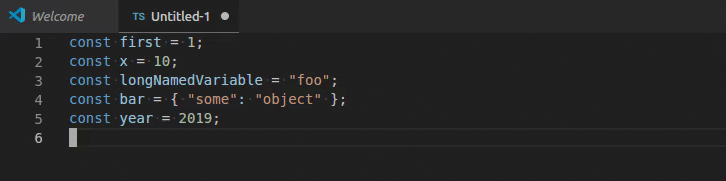

# Malign README

This extension allows for lines to align based on a regex provided by the user.

## Features

Malign allows the user to specify an input string for the alignment.

It also allows the user to specify a regex to match for the alignment.

## Usage

Install the extension, select some text, and choose `Malign` from the command window!

## Release Notes

## 0.2.0

- Fix alignment issue when match happened on ends of a line
